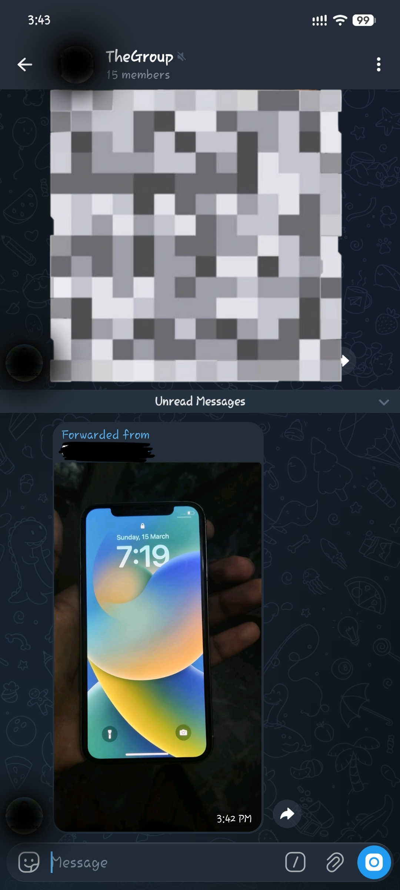

# Bot Hooker
Bot Hooker is script made by DevAyu-Codes that can snatch user inputs and bot outputs even when the bot's api is being used by any other service or code from private telegram chat, it is basically designed to capture images and videos but can be modified for anything.

---
## Example:
| Bot Chat | Group Forward |
| :---: | :---: |
|  |  |

---
## Setup:
### 1. Cloning the repo:
```git
git clone https://github.com/DevAyu-Codes/BotHooker.git
```

### 2. Editing the script:
```bash
micro BotHooker/script/multi_bot_logger.py
```
add your bot api in `BOT_TOKENS` list and change `-10012345678` with your actual group id. You can also change `WORKERS_PER_BOT` according to your pc specs and preference. Save with `ctrl+x, y and enter`.

Note that you need to add the bots to the group and make them admins, the group can be public or private.

### 3. Autostart on system boot:
```bash
micro /etc/systemd/system/tg_logger.service
```
and paste the code, change all `username` with your actual username:
```bash
[Unit]
Description=Telegram Multi-Bot Logger (Fast RAM Lock)
After=network.target

[Service]
Type=simple
User=username
WorkingDirectory=/home/username/scripts
ExecStart=/usr/bin/python3 /home/username/scripts/multi_bot_logger.py
Restart=always
RestartSec=5

[Install]
WantedBy=multi-user.target
```

### 4. Starting the service:
```bash
sudo systemctl daemon-reload
sudo systemctl enable tg_logger.service
sudo systemctl start tg_logger.service
```

---
## Note:
This script is for education purpose only, I or nobody is responsible for stolen bot apis, data or misuse of service. Use at your own risk!
